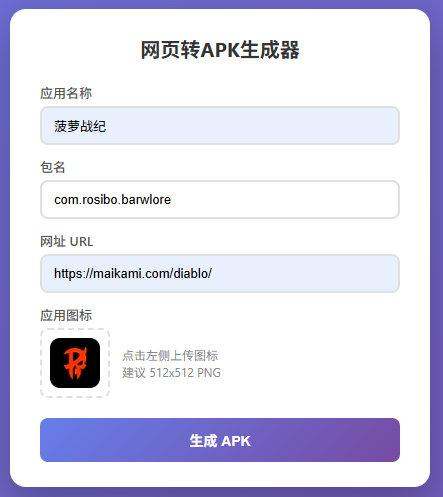

# 网页转APK生成器

一个简单易用的网页转Android APK工具，可以将任意网页打包成Android应用。



## 功能特性

### 基础功能
- 将任意网址打包成 Android APK 应用
- 自定义应用名称、包名和图标
- 支持上传已有签名证书（用于 APP 更新）
- 自动生成签名证书（首次发布）
- 实时显示构建进度
- 纯本地运行，无需联网（首次构建除外）

### 界面定制
- 📱 **屏幕方向** - 竖屏锁定/横屏锁定/自由旋转
- 🎨 **启动画面** - 自定义背景色 + 应用图标
- 🌙 **状态栏颜色** - 自定义状态栏颜色，自动适配文字颜色
- 🔲 **全屏模式** - 隐藏状态栏的沉浸式体验
- 🔢 **版本号配置** - 更新 APP 时可配置版本号

### WebView 增强
- ⚙️ **下拉刷新** - 可选功能，生成时勾选启用
- ⚠️ **离线错误页** - 网络错误/HTTP 错误统一处理，带重试按钮
- 📷 **文件上传** - 支持拍照、相册选择、文件选择
- 📥 **文件下载** - 自动调用系统下载管理器，通知栏显示进度
- 🎬 **视频全屏** - HTML5 视频全屏播放支持
- 🔗 **外部链接** - 外域链接用内置浏览器打开，不跳出 APP
- 💬 **JS弹窗支持** - alert/confirm/prompt 原生弹窗
- 📍 **位置权限** - 支持网页定位功能（地图、附近的人等）
- 🔍 **UA 标识** - 自动附加 Web2APK/1.0 标识，方便网站统计

### 运营增强
- 🔗 **深度链接** - 从微信/短信/浏览器点击链接直接打开 APP
- 📤 **分享目标** - 其他 APP 分享链接时可选择本 APP 打开
- 🎬 **画中画** - 视频全屏播放时按 Home 键变小窗悬浮
- 📌 **桌面小组件** - 网页可推送数据到桌面显示（天气/待办等）
- ⚡ **快捷方式** - 长按图标弹出快捷入口菜单

### JS 接口能力（网页可调用）
- 📤 **系统分享** - 调用系统分享面板（微信、QQ 等）
- 🌐 **网络状态** - 实时监听网络变化 + 主动查询
- 💡 **屏幕常亮** - 控制屏幕保持常亮（考试、导航场景）
- 📳 **振动反馈** - 触发设备振动（支持静音模式）
- 📷 **扫码功能** - 调用摄像头扫描二维码/条形码
- 🔔 **本地通知** - 立即发送或定时提醒
- 🧹 **缓存清理** - 清理 WebView 缓存
- 🎨 **动态状态栏** - JS/Meta 标签动态修改状态栏颜色
- 📋 **剪贴板操作** - 复制/读取剪贴板（淘宝口令等）
- 🔐 **生物识别** - 指纹/面容验证（支付、登录场景）
- 🔔 **前台服务** - 通知栏常驻保活（音乐、导航场景）
- 🌐 **Google 登录** - 海外用户一键登录（需配置 Client ID）

## 环境要求

- Windows 10/11
- Python 3.8+
- 约 1GB 磁盘空间（用于 JDK 和 Android SDK）

## 快速开始

### 1. 安装环境

首次使用需要安装依赖环境：

```bash
# 方式一：运行安装脚本
python setup_env.py
# 双击运行
start.bat
```

### 3. 生成APK

1. 打开浏览器访问 http://localhost:5000
2. 填写应用信息：
   - **应用名称**：显示在手机上的应用名
   - **包名**：如 `com.example.myapp`（小写字母、数字和点）
   - **网址**：要打包的网页地址
   - **图标**：建议 512x512 PNG 图片
3. （可选）使用已有证书：
   - 勾选"使用已有证书"
   - 上传 `.keystore` 或 `.jks` 证书文件
   - 填写证书密码、密钥别名和密钥密码
4. 点击"生成 APK"按钮
5. 等待构建完成后下载 ZIP 文件（包含 APK + 证书 + 密码信息）

## 项目结构

```
apk/
├── app.py                 # Flask 后端服务
├── setup_env.py           # 环境安装脚本
├── start.bat              # 启动脚本
├── install.bat            # 安装脚本
├── set_env.bat            # 环境变量设置
├── requirements.txt       # Python 依赖
├── templates/
│   └── index.html         # 网页界面
├── static/                # 静态资源
├── android-template/      # Android 项目模板
│   ├── app/
│   │   └── src/main/
│   │       ├── java/      # Kotlin 源码
│   │       ├── res/       # 资源文件
│   │       └── AndroidManifest.xml
│   ├── gradle/
│   ├── build.gradle
│   └── gradlew.bat
├── tools/                 # 开发工具（自动下载）
│   ├── jdk/               # OpenJDK 17
│   └── android-sdk/       # Android SDK
└── output/                # 构建输出目录
```

## 技术栈

- **后端**：Python + Flask
- **前端**：HTML + CSS + JavaScript
- **Android**：Kotlin + WebView
- **构建**：Gradle 8.0

## 生成的 APK 说明

生成的 APK 是一个基于 WebView 的 Android 应用，特性：

- 全屏显示网页内容
- 支持 JavaScript
- 支持本地存储 (localStorage/IndexedDB)
- 支持 Cookie 持久化（登录状态保持）
- 支持文件上传（拍照/相册/文件）
- 支持文件下载（系统下载管理器）
- 支持视频全屏播放
- 支持网页定位功能
- 内置浏览器打开外部链接
- 自动附加 Web2APK/1.0 UA 标识
- 最低支持 Android 7.0 (API 24)
- 目标版本 Android 14 (API 34)

## 常见问题

### Q: 构建失败怎么办？

1. 确保已运行 `install.bat` 完成环境安装
2. 检查终端输出的错误信息
3. 确保网络正常（首次构建需要下载依赖）

### Q: 首次构建很慢？

首次构建需要下载 Gradle 依赖，可能需要 3-5 分钟，后续构建会快很多（约 30 秒）。

### Q: 如何修改 APK 的更多属性？

编辑 `android-template/app/build.gradle` 文件可以修改：
- `versionCode` - 版本号
- `versionName` - 版本名称
- `minSdk` - 最低支持的 Android 版本

### Q: 如何更新已发布的 APP？

更新 APP 时必须使用相同的签名证书：
1. 首次生成时，下载的 ZIP 包含 `release.keystore` 证书文件
2. 更新时，勾选"使用已有证书"，上传之前的证书文件
3. 填写首次生成时保存的密码信息

**重要**：如果丢失证书，将无法更新已安装的 APP，只能卸载后重新安装。

### Q: 生成的 APK 可以上架应用商店吗？

生成的 APK 使用 Release 签名，可以上架应用商店。需要注意：
1. 妥善保管签名证书，更新时需要使用相同证书
2. 符合应用商店的其他审核要求

## 许可证

MIT License

## 更新日志

### v1.5.0
- 新增：前台服务（Foreground Service）- 通知栏常驻保活，适用于音乐/导航场景
- 新增：剪贴板操作（Clipboard）- 复制/读取剪贴板，支持淘宝口令等场景
- 新增：生物识别（Biometric）- 指纹/面容验证，提升安全感
- 新增：Google 登录 - 海外用户可用的一键登录（需配置 Client ID）

### v1.4.0
- 新增：扫码功能（调用摄像头扫描二维码/条形码）
- 新增：本地通知（支持立即发送和定时提醒）
- 新增：网络状态监听（实时回调 + 主动查询）
- 新增：屏幕常亮控制（JS 接口）
- 新增：振动反馈（JS 接口，支持静音模式）
- 新增：动态状态栏（支持 JS/Meta 标签控制，自动适配深色模式）
- 新增：缓存清理（JS 接口，支持清理磁盘缓存）
- 新增：深度链接（Deep Links）- 从微信/短信/浏览器直接打开APP
- 新增：分享目标（Share Target）- 其他APP分享链接时可选本APP打开
- 新增：画中画（PiP）- 视频全屏播放时按Home键变小窗悬浮
- 新增：桌面小组件（Widget）- 网页可推送数据到桌面显示
- 新增：快捷方式（Shortcuts）- 长按图标弹出快捷入口菜单

### v1.3.0
- 新增：HTML5 视频全屏播放支持
- 新增：外部链接内置浏览器（微信风格）
- 新增：JS 弹窗支持（alert/confirm/prompt）
- 新增：位置权限支持（运行时请求）
- 新增：User-Agent 附加 Web2APK/1.0 标识
- 优化：下拉刷新改为可选功能，默认关闭
- 优化：文件下载支持更多格式（MP4/PNG/MP3等）

### v1.2.0
- 新增：屏幕方向选择（竖屏/横屏/自由旋转）
- 新增：启动画面自定义背景色
- 新增：状态栏颜色自定义，自动适配文字颜色
- 新增：全屏沉浸式模式
- 新增：版本号配置
- 新增：下拉刷新支持
- 新增：离线错误页面（带重试按钮）
- 新增：文件上传支持（拍照/相册/文件）
- 新增：文件下载支持（系统下载管理器）
- 优化：使用系统 Photo Picker，选择相册无需存储权限

### v1.1.0
- 新增：支持上传已有签名证书（用于 APP 更新）
- 优化：使用 Release 签名构建，可直接上架应用商店
- 优化：下载包自动包含证书和密码信息

### v1.0.0
- 初始版本
- 支持网页转 APK
- 自定义应用名称、包名、图标
- 实时构建进度显示
